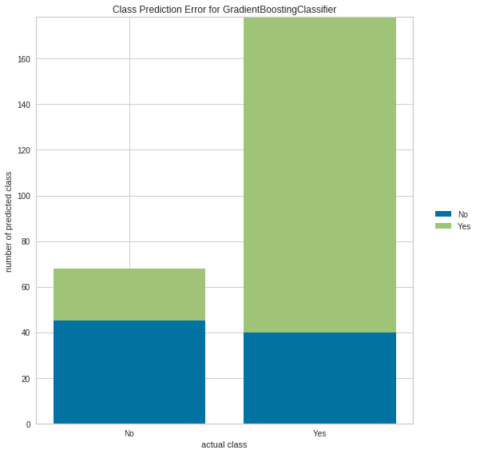
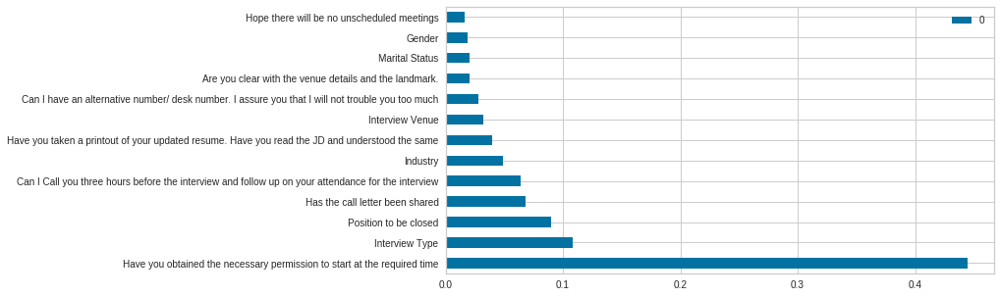

# The_Interview_Attendance_Problem
The Interview Attendance Problem is a data set for predicting whether or not a job candidate will show up to the job interview based on a set of parameters.

In this graph we see that the Gradient Classifier model did the best job of predicting a 'Yes' or 'No' in the Observed Attendance for a job interview.

The prediction of observed attendance is influenced mostly by the parameter 'Have you obtained the necessary permission to start at the required time', 'Interview Type' and 'Position to be Closed'.  

